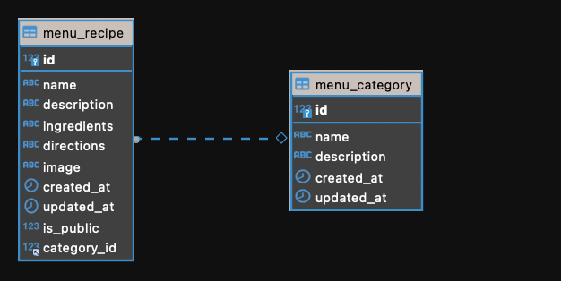

  <h3 align="center">Do an WEB</h3>

<!-- TABLE OF CONTENTS -->

## Table of Contents

- [About the Project](#about-the-project)
  - [Built With](#built-with)
- [Getting Started](#getting-started)
  - [Prerequisites](#prerequisites)
  - [Installation](#installation)
- [Contributing](#contributing)
- [License](#license)
- [Contact](#contact)

<!-- ABOUT THE PROJECT -->

## About The Project

- Day la du an API cho trang Web LH.
- Dung de bao cao mon hoc LTUDW.

### Built With

- Django

<!-- GETTING STARTED -->

## Getting Started

### Prerequisites

- python
- pip
- pipenv
- docker engine
- docker compose

### Installation

#### Cach 1:

0. Clone repo

```
git clone https://github.com/minhthong582000/LH-back-end.git
```

1. Di chuyen vao thu muc LH-back-end

```
cd LH-back-end
```

2. Tao virtual env

```
pipenv shell
```

3. Cai dat python packages

```
pipenv install
```

4. Di chuyen vao thu muc app

```
cd LHBackend
```

5. Chay migration

```
python manage.py migrate
```

6. Tao tai khoan admin cho trang admin:

```
python manage.py createsuperuser
```

7. Chay API

```
python manage.py runserver 0.0.0.0:8000
```

#### Cach 2 (Chay voi Docker):

0. Chinh sua env cho API trong dev.env:

```
SQL_ENGINE=django.db.backends.mysql
SQL_DATABASE=api
SQL_USER=thongdeptrai
SQL_PASSWORD=thongdeptrai
SQL_HOST=db
SQL_PORT=3306

DJANGO_SUPERUSER_PASSWORD=thongdeptrai
DJANGO_SUPERUSER_EMAIL=thongdeptrai@thongdeptrai.com
DJANGO_SUPERUSER_USERNAME=thongdeptrai
```

1. Chinh sua env cho database:

```
MYSQL_ROOT_PASSWORD=thongdeptrai
MYSQL_DATABASE=api
MYSQL_USER=thongdeptrai
MYSQL_PASSWORD=thongdeptrai
```

2. Chay voi docker:

```
docker-compose up -d
```

## Cac api

- api: http://localhost:8000/api

- docs: http://localhost:8000/api_docs hoac http://localhost:8000/docs/

- admin: http://localhost:8000/admin

## Database hien tai (Dang Update...)



## Contributing

Day la du an hoan toan Open. Moi nguoi co the thoai mai:

1. Fork du an
2. Tao Feature Branch (`git checkout -b feature/AmazingFeature`)
3. Commit thay doi (`git commit -m 'Add some AmazingFeature'`)
4. Push len Branch (`git push origin feature/AmazingFeature`)
5. Tao mot Pull Request

<!-- LICENSE -->

## License

Distributed under the APACHE License. See `LICENSE` for more information.

<!-- CONTACT -->

## Contact

- Le Minh Thong - [linkedin](https://www.linkedin.com/in/minhthong582000/) - 18521457@gm.uit.edu.vn
